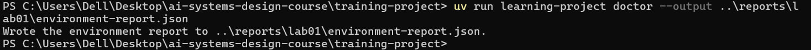
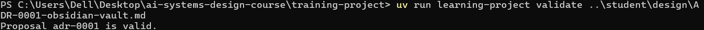
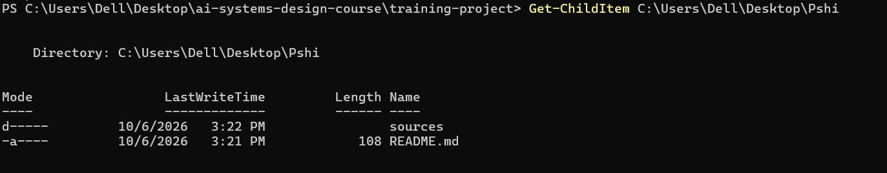
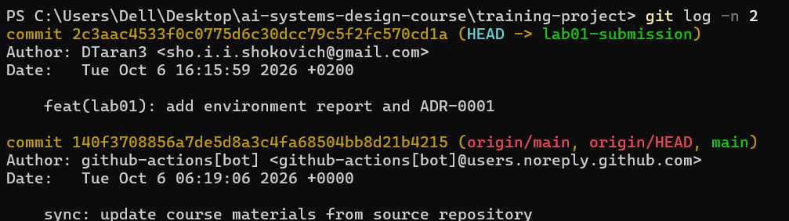
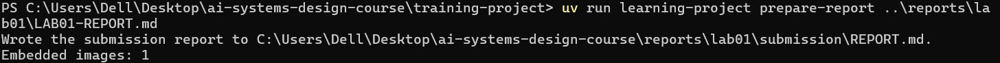
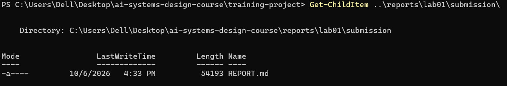
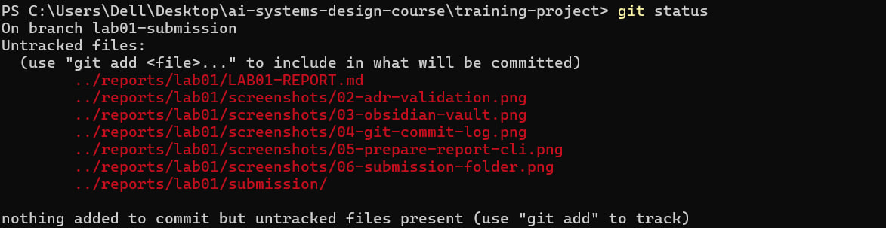

# Lab 01 Report: Environment Setup & Decision Record

## Student Information
- **Name:** Denys Taran
- **Git User:** DTaran3
- **Email:** sho.i.i.shokovich@gmail.com

## 1. Environment Doctor Validation

## 2. Architectural Decision Record (ADR-0001)

## 3. External Knowledge Vault Setup

## 4. Git Configuration & Commit History

## 5. CLI Report Generation

## 6. Generated Submission Package Directory

## 7. Final Repository Status

