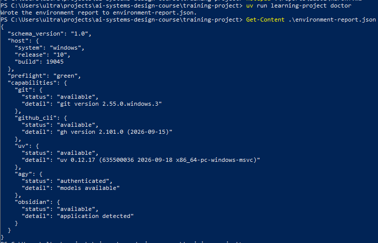
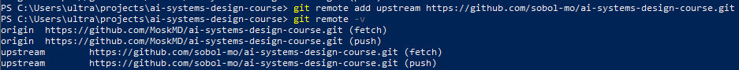
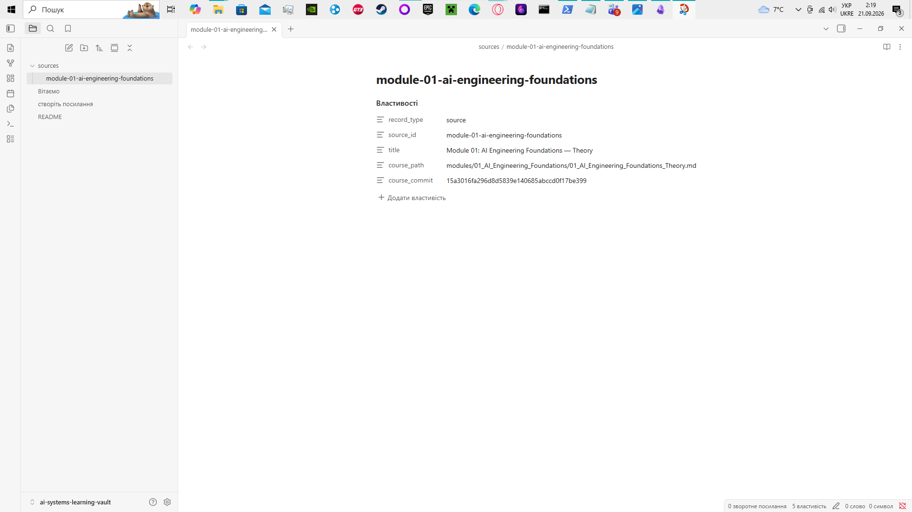
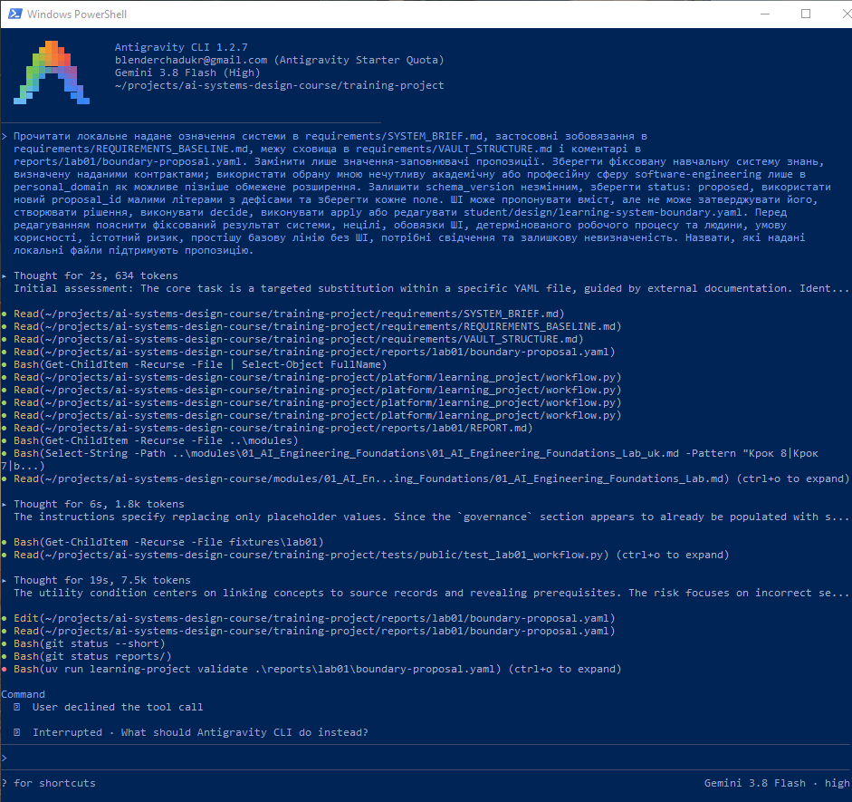
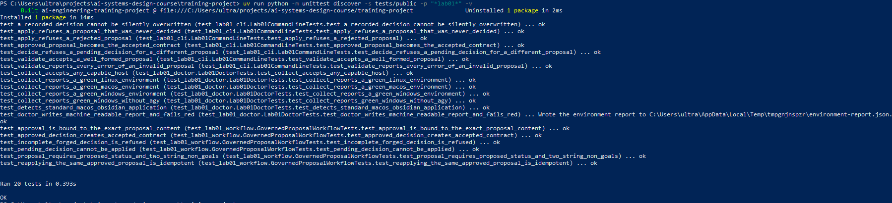
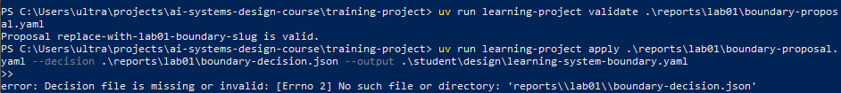
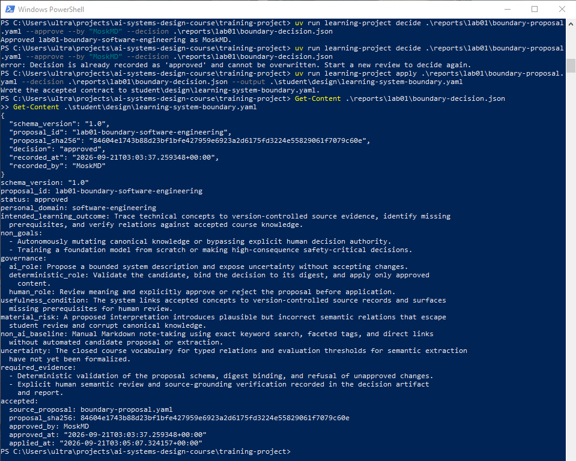

# Лабораторна робота 01

Заповнити кожен розділ власними словами українською мовою. Не вилучати заголовки. У потрібних розділах додати знімки екрана відносними шляхами Markdown до файлів у `screenshots/` із точними іменами, названими в лабораторній роботі. Підпис ставити наступним рядком після зображення.

## Ідентифікація подання

- URL форку: https://github.com/MoskMD/ai-systems-design-course
- Назва гілки: lab01/moskmd
- Повний хеш коміту: 15a3016fa296d8d5839e140685abccd0f17be399

## Середовище

Робоча станція функціонує під керуванням Windows 10 Pro. Утиліти Git, GitHub CLI, uv, Obsidian та Antigravity CLI (agy). Перевірка спроможностей середовища виконана через команду `uv run learning-project doctor` - усі перевірки інструментів успішно повертають зелений статус без критичних блокувань.

Рисунок - `02-workstation-capabilities.png`

## Власність репозиторію

Репозиторій налаштовано відповідно до правил форк-роботи: віддалений репозиторій `origin` вказує на особистий форк `https://github.com/MoskMD/ai-systems-design-course`, а `upstream` на канонічний базовий репозиторій курсу. Робота ведеться в ізольованій персональній гілці `lab01/moskmd`.

Рисунок - `01-git-remotes.png`

## Зовнішнє сховище Markdown-файлів

Розташування сховища визначено як `external to repository` - каталог `ai-systems-learning-vault` створено поза межами робочого дерева репозиторію Git, що підтверджується відсутністю змін у `git status`. Сховище містить файл `README.md` із реєстрацію первинного джерела курсу `sources/module-01-ai-engineering-foundations.md` із хешем коміту `15a3016fa296d8d5839e140685abccd0f17be399`.

Рисунок - `05-external-vault.png`

## Шлях пропонувача

Для формування чернетки пропозиції використано інтерактивний сеанс ШІ-агента Antigravity CLI (`agy`) із моделлю Gemini 3.8 Flash. Агентові надано завдання опрацювати контракти `SYSTEM_BRIEF.md`, `REQUIREMENTS_BASELINE.md` та `VAULT_STRUCTURE.md`. Агент діяв виключно в межах ролі пропонувача: виконав читання локальних контрактів і відредагував виключно файл `reports/lab01/boundary-proposal.yaml`. Спроби виклику інструментів схвалення рішень або застосування змін були відхилені або не виконувалися.

Рисунок - `04-proposer-session.png`

## Семантичний розгляд

Записати відповідь і висновок для кожного з дев’яти запитань кроку 8 **до** запуску `decide`.

1. Пропозиція зберігає фіксовану навчальну систему знань курсу щодо зв'язку концепцій і джерел. Поле `personal_domain: software-engineering` додане суто як нечутливе пізніше розширення і не підміняє межі системи.
2. Запланований навчальний результат формулює спостережувану здатність студента простежувати технічні концепції до зафіксованих комітів джерел, виявляти прогалини та верифікувати зв'язки, а не абстрактне застосування ШІ.
3. Нецілі явно блокують автономну мутацію канонічної бази знань моделлю, навчання фундаментальних моделей з нуля, ухвалення рішень із високими ризиками та збереження конфіденційних персональних даних.
4. Розподіл обов'язків обмежує роль ШІ висуванням чернеток пропозицій і фіксацією невизначеностей; детермінований процес забезпечує валідацію схем і зв'язку хешів; право ухвалення рішень належить виключно студенту.
5. Умову корисності можна верифікувати перевіркою наявності зв'язків між кожним концептом і точним комітом джерела у сховищі знань та наявністю явного повідомлення про відсутні пререквізити.
6. Істотний ризик визначає правдоподібну відмову повного процесу — непомічене потрапляння згенерованих моделлю псевдо-правдоподібних, але насправді помилкових семантичних зв'язків у канонічний стан через недостатній людський аудит.
7. Ручне ведення структурованих нотаток у Markdown із використанням фасетних тегів та прямого пошуку за ключовими словами є простішим, надійним детермінованим базисом без залучення ШІ.
8. Пункти потрібних свідчень охоплюють машинну валідацію схеми, перевірку незмінності дайджесту SHA-256, фіксацію відмови передчасного apply та задокументований семантичний розгляд людиною.
9. Невизначеність чітко вказує на те, що ще не формалізовано на етапі Лабораторної роботи 01: точний замкнений словник типізованих відношень курсу та кількісні критерії вилучення концептів.

## Розподіл повноважень

У нормальній роботі системи ШІ має роль виключно генератора пропозицій, оскільки ймовірнісні мовні моделі здатні генерувати правдоподібні, але фактично некоректні твердження. Надання ШІ автономного права вносити зміни до канонічної 
бази знань порушує принцип підзвітності та призводить до неконтрольованого накопичення семантичних помилок. Детермінований конвеєр перевіряє синтаксис і зв'язує рішення з хешем SHA-256, проте виключне право затверджувати 
або відхиляти зміни належить людині, яка несе відповідальність за змістовну точність стану. У процесі роботи агент Antigravity CLI формував виключно чернетку пропозиції, а всі спроби автономного запуску інструментів валідації чи 
застосування контролювалися та блокувалися людиною. Навіть якби використовувався ручний запасний шлях, особа лише заповнювала би файл-кандидат boundary-proposal.yaml безпосередньо, не змінюючи саму заплановану межу розподілу ролей
(остаточне рішення все одно вимагало б окремого підписаного кроку затвердження).

## Корисність і базова лінія без ШІ

ШІ є корисним для аналізу неструктурованих текстів, виявлення неявних смислових зв'язків між розрізненими концепціями, формулювання зв'язних гіпотез, що прискорює синтез навчального графа. Простіша базова лінія без ШІ вже забезпечує 
детермінованість, стабільність і швидку навігацію між зафіксованими фактами. Однак вона вимагає суто ручного зіставлення кожного нового поняття з усіма наявними матеріалами, що масштабується лінійно зі зростанням обсягу знань.

## Особиста предметна сфера як пізніше розширення

Запланований навчальний результат системи повністю зберігає фокус на навчальній системі знань: побудова зв'язків між технічними концепціями проєктування AI-систем та їхнє строге трасування до версіованих першоджерел під контролем Git. 
Використання software-engineering дозволяє в подальшому формувати практичні приклади реалізації (код, інтерфейси, конфігурації).

## Проєктний компроміс

Основним проєктним компромісом є вибір між затримкою та ризиком деградації якості. Автономне оновлення бази моделлю мінімізувало б часові витрати. Запровадження обов'язкового ручного аудиту збільшує затримку внесення кожного нового 
твердження, проте повністю гарантує достовірність задуму.

## Детерміновані перевірки

Тестовий набір у tests/public/test_lab01_workflow.py успішно виконано за допомогою команди:
uv run pytest tests/public/test_lab01_workflow.py

Спроба застосувати неперевірену або ще не схвалену людиною пропозицію командою завершилася очікуваною детермінованою
відмовою інструменту через відсутність валідного підписаного артефакту рішення:
uv run learning-project apply .\reports\lab01\boundary-proposal.yaml --decision .\reports\lab01\boundary-decision.json --output .\student\design\learning-system-boundary.yaml

Після виконання окремого кроку затвердження сформовано артефакт рішення з SHA-256 хешем.

Подальший виклик apply успішно перевірив збіг криптографічного дайджесту та створив фінальний узгоджений контракт.

Рисунок - `03-public-tests.png`

Рисунок - `06-premature-apply-refused.png`

Рисунок - `07-accepted-contract.png`

Чому успішний валідатор схеми не доводить якість проєкту?:
Команда uv run learning-project validate перевіряє виключно формальну відповідність синтаксису YAML та схеми. Валідатор схеми не здатний аналізувати зміст і семантику, він прийме будь-який синтаксично коректний текст, навіть якщо 
сформульовані нецілі є абсурдними, умова корисності не відповідає реальним джерелам, або запропонований ШІ-агентом поділ обов'язків містить приховані галюцинації. Структурна валідність є мінімальною необхідною передумовою, тоді як
оцінка семантичної якості, безпеки та архітектурної придатності системи гарантується виключно змістовним аудитом з боку людини перед ухваленням рішення.

## Відновлення

Для відновлення відтворюваного середовища на новій робочій станції встановлюються Git, GitHub CLI, uv, Obsidian та виконується команда uv sync у каталозі проєкту. Артефакти проєкту відновлюються клонуванням форку з GitHub із переходом 
на робочу гілку git checkout lab01/moskmd. Змінне сховище ai-systems-learning-vault зберігається локально у файловій системі поза межами репозиторію Git; його канонічний стан наразі не має налаштованої автоматичної копії поза пристроєм.
