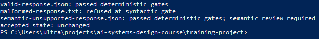
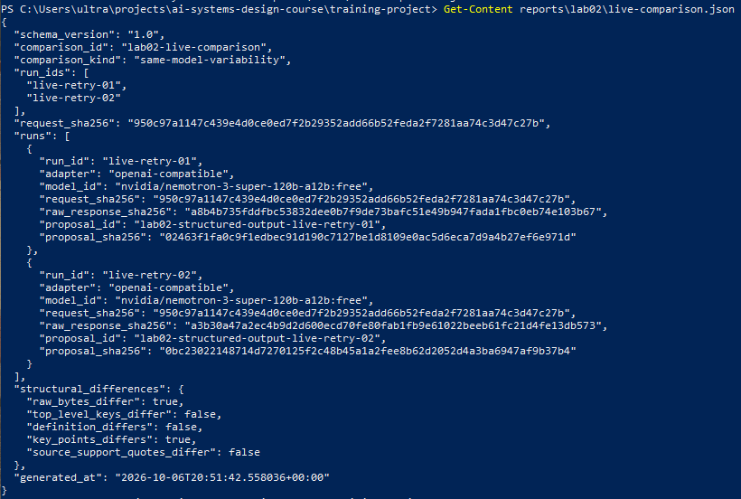
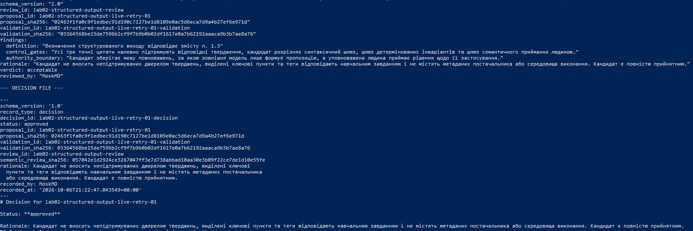
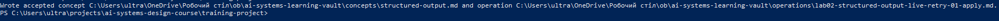
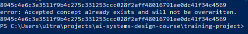
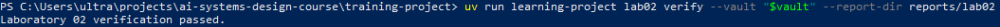

# Лабораторна робота 02

## Ідентифікація подання

- URL форку: https://github.com/MoskMD/ai-systems-design-course
- Назва особистої гілки: lab02/moskmd
- Повний хеш коміту зі свідченнями: 9973ba843c46cb7735fbaffe26467115a52fb593

## Мета роботи

Побудувати детермінований і контрольований контур опрацювання структурованого виходу зовнішніх моделей машинного навчання для безпечного наповнення. Забезпечити архітектурне розмежування зон відповідальності,за якого зовнішня модель 
володіє виключно правом формувати пропозиції, синтаксичні та інваріантні шлюзи детерміновано відсікають невалідні структури, а повноваження щодо фіксації рішень і перенесення артефактів у прийнятий стан належать виключно 
уповноваженому експерту-людині через криптографічно зв'язаний аудиторський слід.

## Початковий стан і реєстрація джерела

Роботу розпочато зі синхронізації особистого форку з репозиторієм курсу. 

У межах підготовки виконано реєстрацію точного нормалізованого фрагмента теорії модуля, у файл сховища sources/structured-output-theory.md за допомогою команди register-source. Поле course_commit фіксує точний базовий хеш коміту 
upstream-репозиторію, з якого було вилучено канонічний текст теорії, а не коміт поточного студентського подання. Це необхідно для того, щоб наступні перевірки могли детерміновано підтвердити походження вихідних знань і відсутність 
дрейфу навчальних матеріалів відносно зафіксованого джерела істини незалежно від наступних локальних комітів у студентській гілці.

## Детерміновані шлюзи

Поведінку автоматизованого контуру перевірено на трьох еталонних тестових фікстурах

malformed-response.txt: Відхилено на синтаксичному шлюзі через порушення синтаксису JSON або відхилення від JSON Schema.
semantic-unsupported-response.json: Пройшов синтаксичний шлюз і шлюз детермінованих інваріантів, однак був затриманий перед сховищем із вимогою обов'язкового семантичного огляду, оскільки містив непідтверджені джерелом твердження.
valid-response.json: Подолав детерміновані синтаксичні шлюзи та шлюзи інваріантів, проте прийнятий стан сховища залишився незмінним.

Успішне проходження синтаксичної перевірки та перевірки інваріантів підтверджує те, що форма представлення та внутрішня зв'язність даних відповідають технічній специфікації. Ці шлюзи є формальними фільтрами й позбавлені семантичного 
розуміння змісту, тому вони не можуть надати дозвіл на перенесення кандидата до канонічного знання.

Рисунок — `01-offline-gates.png`

## Живі запуски та порівняння

Для перевірки реальної взаємодії з моделлю виконано два незалежні живі виклики через уніфікований адаптер 
openai-compatible до безкоштовної моделі постачальника OpenRouter.

Згенеровані артефакти порівняння зафіксовано у файлі reports/lab02/live-comparison.json. Обидва запуски здійснено 
за побітово ідентичного запиту (SHA-256 запиту: 950c97a1147c439e4d0ce0ed7f2b29352add66b52feda2f7281aa74c3d47c27b). 
Оскільки адаптер і назва моделі повністю збігаються, порівняння класифіковано як same-model-variability.

У структурованих відмінностях зафіксовано raw_bytes_differ: true та key_points_differ: true при збереженні 
тотожності схеми ключів, визначення та цитат. Модель сформулювала пункти списку key_points різними лексичними 
конструкціями за збереження загальної структури, що підтверджує недетермінованість поведінки великих мовних моделей 
при повторних викликах за однакової температури генерації.

Рисунок — `03-live-comparison.png`

## Семантична коректність і повноваження

Успішний результат команди validate та підтримка схеми на стороні постачальника гарантують лише формальну 
валідність типу даних. Вони не перевіряють фактологічну правдивість, релевантність тверджень контексту джерела та 
відсутність «галюцинацій».

Єдиним актором, наділеним повноваженнями прийняти або відхилити кандидата, є людина.

Межі повноважень у системі розмежовані:
1) Зовнішня модель володіє нульовими повноваженнями впливу на стан системи; вона лише формує необов'язкову 
пропозицію.
2) Валідатор має право відхилити кандидата з синтаксичних причин чи порушення інваріантів, але не має права 
самостійно схвалити перенесення знань.
3) Операція застосування виконує дію внесення змін виключно як транзакційний виконавець за наявності валідного 
криптографічного ланцюжка схвалення людиною.

## Семантичний розгляд і рішення

Під час семантичного аналізу lab02-structured-output-live-retry-01 у файлі reports/lab02/semantic-review.yaml 
підтверджено що усі три цитати належно підтримують твердження щодо синтаксичного відокремлення, інваріантів та меж 
повноважень.

Відсутні непідтримувані або вигадані твердження, а також метадані платформ чи середовищ виконання.

Вердикт визначено як acceptable. Рішення зафіксовано командою decide у сховищі у файлі зі статусом approved 
рецензентом MoskMD, воно стосується виключно цього кандидата, оскільки жорстко зв'язане дайджестами 
proposal_sha256 та validation_sha256.

Рисунок — `04-review-decision.png`

## Прив’язки SHA-256

Контрольний контур базується на наскрізному ланцюжку криптографічних хешів

Джерело і фрагмент: source_sha256 у записі джерела однозначно фіксує канонічний вміст вихідного розділу теорії.

Запит і відповідь: request_sha256 та raw_response_sha256 у метаданих запуску зв'язують переданий системний промпт із відповіддю мережевого виклику.

Пропозиція і перевірка: proposal_sha256 у звіті валідації гарантує, що перевірявся саме немодифікований файл пропозиції.

Розгляд і рішення: validation_sha256 та semantic_review_sha256 у файлі рішення унеможливлюють підміну рецензії чи результатів автоматичної перевірки.

Рішення і прийняте поняття: Блок метаданих accepted_from у файлі поняття фіксує proposal_sha256 та decision_sha256, формуючи нерозривний аудиторський слід.

Дайджести SHA-256 гарантують виключно цілісність і незмінність даних у байтах. Вони не є доказом того, що текст був згенерований саме зовнішньою моделлю, і не доводять семантичну істинність змісту.

## Контрольоване застосування

Застосування схваленого кандидата виконано командою lab02 apply. У сховищі створено поняття concepts/structured-output.md 
та зареєстровано єдиний запис операції operations/lab02-structured-output-live-retry-01-apply.md зі статусом applied.

Запис прийнятого стану став можливим завдяки наявності повного набору передумов: успішного результату детермінованої
валідації, семантичного вердикту acceptable, підписаного рішення зі статусом approved, збігу всіх проміжних хешів 
та відсутності попередньо створеного однойменного поняття в сховищі.

Рисунок — `05-controlled-apply.png`

## Відмова без зміни прийнятого стану

Для перевірки захисту від несанкціонованого або повторного перезапису виконано повторний виклик команди lab02 apply 
для того ж кандидата.

Команда завершилася контрольованою помилкою: Accepted concept already exists and will not be overwritten. 
У сховищі зберігся рівно один запис операції типу apply. Хеш-сума поняття concepts/structured-output.md до спроби 
повторного застосування та після неї виявилася побітово тотожною, що доводить повну незмінність канонічного знання 
під час відмови.

Рисунок — `02-refusal-unchanged.png`

## Проєктний компроміс

Основним проєктним компромісом є вибір між вартістю формування пропозицій та надійністю системи й витратами на 
контроль. Використання компактних безкоштовних або дешевих моделей мінімізує прямі фінансові витрати на API, проте 
вимагає суворого багаторівневого детермінованого контролю схеми, повторних запусків та виділення дорогого людино-часу 
експерта на семантичне рецензування. Більш потужні та дорогі моделі можуть демонструвати стабільніші формулювання, 
проте вони не усувають потребу в людському шлюзі та несуть ризик прив'язки до вендора, якщо система покладається на 
специфічні пропрієтарні механізми валідації замість переносних JSON-схем.

## Захист облікових і платіжних даних

Для виклику моделі через OpenRouter API-ключ зчитувався виключно зі змінної оточення середовища через захищений 
механізм і не передавався в командний рядок у відкритому вигляді. Усі файли конфігурації, логи runs/ та артефакти 
звіту перевірено на відсутність чутливих токенів. Було використано безкоштовну квоту OpenRouter, яка не вимагала 
прив'язки платіжної картки, що унеможливило витік фінансових реквізитів.

## Канонічний, аудиторський і похідний стан

Канонічний прийнятий стан, єдиний цільовий файл бази знань — concepts/structured-output.md.

Аудиторський стан:

Метадані живих запусків, тіла запитів і сирих відповідей у reports/lab02/runs/.

Пропозиції кандидатів у $vault/proposals/.

Семантичний огляд reports/lab02/semantic-review.yaml.

Офіційне рішення уповноваженої особи $vault/decisions/.

Журнал здійсненої транзакції $vault/operations/.

Похідний стан, файли порівняння запусків live-comparison.json, звіти валідацій validation-result.json та фінальний 
протокол verification-report.json, які за потреби можуть бути перераховані або повторно згенеровані з аудиторського 
сліду.

## Остаточна перевірка

Команда остаточної перевірки uv run learning-project lab02 verify --vault "$vault" --report-dir reports/lab02 
завершилася зі статусом успіху passed. Усі контрольні перевірки ланцюжка доказів пройдені успішно. 

Остаточна перевірка доводить:

1) Цілісність криптографічного ланцюжка від вихідної теорії до прийнятого поняття.
2) Відсутність спотворення кодової бази курсу.
3) Одноразовість застосування та незмінність стану.

Вона не доводить:

1) Що зовнішня мовна модель володіє розумінням предметної області.
2) Що запропонований текст є абсолютно вичерпним чи універсальним.

Рисунок — `06-final-result.png`

## Висновки

Під час виконання лабораторної роботи №02 розгорнуто та практично апробовано контрольований контур опрацювання 
структурованого виходу. Реалізовано трирівневу систему захисту: відсікання помилок на рівні синтаксичного шлюзу, 
перевірку структурних інваріантів та обов'язкову семантичну авторизацію змін людиною. Проведено порівняльний аналіз 
варіативності моделі та продемонстровано захист сховища від несанкціонованого перезапису.

На підставі наведених свідчень і результатів роботи валідатора мету роботи досягнуто повністю. Контур гарантує 
ізоляцію сховища знань від недетермінованого впливу зовнішніх моделей за збереження повної аудиторської 
простежуваності.